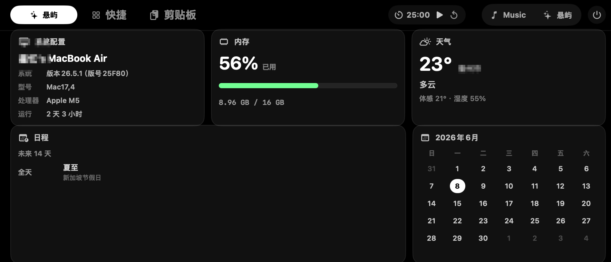
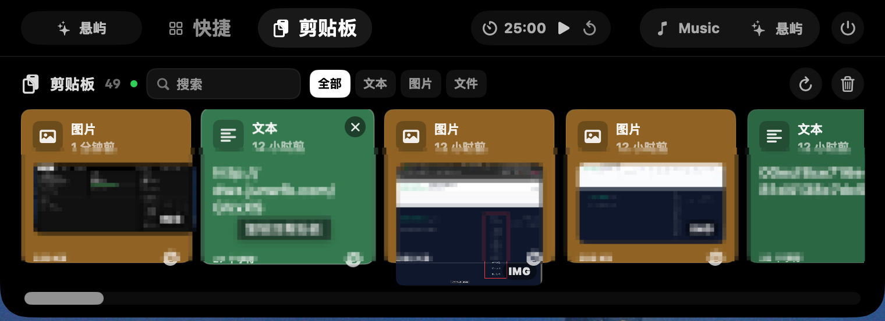
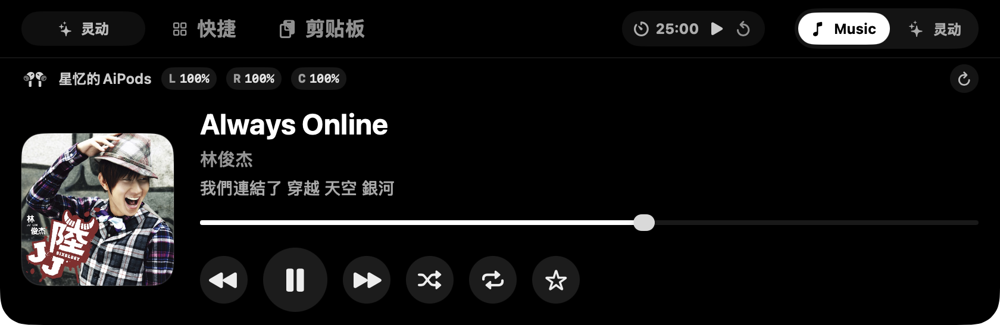
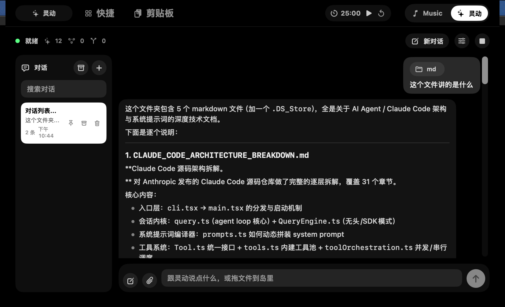

# 悬屿

<p align="center">
  <strong>把 MacBook 顶部变成一个轻量、常驻、可操作的工作入口。</strong>
</p>

<p align="center">
  <a href="https://github.com/ali156666/notchdeck/releases/latest"></a>
  <a href="./LICENSE"></a>
  
  
</p>

<p align="center">
  <a href="https://github.com/ali156666/notchdeck/releases/download/v1.0.27/NotchDeck-1.0.27.dmg"><strong>下载悬屿 v1.0.27</strong></a>
  ·
  <a href="https://github.com/ali156666/notchdeck/releases/latest">查看最新版本</a>
</p>

<p align="center">
  官网地址：<a href="https://notchdeck.xyz/">https://notchdeck.xyz/</a>
  <br>
  API 推荐：<a href="https://shop.xuedingtoken.com/?dist=KDLDYHBS">https://shop.xuedingtoken.com/?dist=KDLDYHBS</a>
</p>

<p align="center">
  
</p>

悬屿是一个 macOS 顶栏悬浮面板应用。它贴着 MacBook 顶部运行，把音乐控制、AirPods 电量、剪贴板、快捷启动、系统看板、番茄钟、Command 语音输入和本地 Agent 收在一个干净入口里。新版界面已适配 macOS 26 Liquid Glass，展开面板、卡片、快捷入口、剪贴板和语音输入 HUD 都使用透明玻璃质感。

## v1.0.27 更新重点

- **CodeWatch**：同时识别 ChatGPT.app、Claude Code 与 Codex；缩小态显示正在运行的来源，任务结束后显示完成提醒并发送 macOS 通知。
- **自选 Codex Pet**：直接读取 `~/.codex/pets`，支持 8×9 v1 与 8×11 v2 spritesheet，缩小态和完成提醒都会使用当前宠物。
- **Agent 长期记忆**：新增有界热记忆、无限记忆笔记、相关性召回与可视化管理。
- **Agent 脚手架与多智能体**：新增计划账本、重复调用检测、工具轮次预算、改动后自检、角色化子 Agent 编队和工程师循环。
- **对话可靠性**：兼容 OpenAI 流式 `reasoning_content` 与多段文本；历史索引缺失时从归档自动恢复，并隔离回归测试数据。
- **完整安装包**：DMG 已包含 Agent runtime、memory、harness 与 subagents 模块，不需要另外安装 Agent CLI。

## 功能

- 贴合 MacBook 刘海区域的展开/收起面板
- macOS 26 原生 Liquid Glass 透明玻璃界面，保留桌面背景透光与柔和模糊
- Apple Music 与 Spotify 播放控制、歌词展示和 AirPods 电量读取
- 收起状态歌词悬浮展示
- 快捷应用启动、剪贴板历史、系统看板、天气、日历与番茄钟
- 编码会话监控：识别 ChatGPT.app、Claude Code 与 Codex，缩小态显示运行来源，完成后通知
- Codex Pet 自选：直接使用 `~/.codex/pets` 中的自定义吉祥物
- 独立 Node Agent runtime，支持冷热分层记忆、任务脚手架、多智能体编队与工程师循环
- OpenAI-compatible 与 Anthropic-compatible 模型接口
- 应用内配置模型、API key、自定义 skills 和本地 MCP servers
- 工具调用确认、文件上传、桌面文件拖入识别和附件对话
- 长按左右 Command 0.5 秒语音输入，支持 Apple 语音识别与离线 SenseVoice 本地模型
- 松开 Command 后先审核识别文本，确认后再发送给 Agent 执行
- 语音输入识别、审核和发送 HUD 已统一为液态玻璃样式

完整版本变化见 [更新日志](./CHANGELOG.md)。

### Agent 与 CodeWatch

- CodeWatch 通过进程发现和 transcript 尾随汇总本机编码会话；可选 Claude hooks 用于补充当前工具、等待审批等实时状态。
- Agent 支持 OpenAI-compatible 与 Anthropic-compatible 接口，可在应用内配置模型、API key、skills 和本地 MCP servers。
- 冷热分层记忆把常用事实留在热记忆，把长期资料保存为按需召回的记忆笔记。
- 多智能体按探路、执行、评审、验证、汇总五种角色隔离工具权限，支持并行、串行和“实现 → 评审 → 返工”的工程师循环。
- 对话保存在本机；UI 索引损坏或缺失时会从会话归档恢复，主动删除的对话通过删除墓碑保持删除状态。

完整的 Agent、CodeWatch、记忆和多智能体说明见 [Xuanyu/README.md](./Xuanyu/README.md#agent)。

## 截图

| 系统看板 | 剪贴板 |
| --- | --- |
|  |  |

| 音乐控制 | 歌词悬浮 |
| --- | --- |
|  |  |

| Agent 设置 |
| --- |
|  |

## 快速开始

### 下载安装包

1. 下载 [NotchDeck-1.0.27.dmg](https://github.com/ali156666/notchdeck/releases/download/v1.0.27/NotchDeck-1.0.27.dmg)。
2. 打开 DMG，把「悬屿.app」拖入「Applications」。
3. 首次启动时，在「应用程序」中按住 Control 点击「悬屿.app」，选择「打开」。
4. 悬屿是顶栏常驻应用，不会出现在 Dock；启动后在屏幕顶部中央展开它。

安装包的 SHA-256 校验值同时发布在 [v1.0.27 Release](https://github.com/ali156666/notchdeck/releases/tag/v1.0.27) 页面。

### 环境要求

- macOS 26 或更新版本
- Xcode 26 或匹配 macOS 26 SDK 的 Command Line Tools
- Node.js 18 或更新版本

### 从源码运行

```bash
git clone https://github.com/ali156666/notchdeck.git
cd notchdeck/Xuanyu
./build.sh
```

### 打包 DMG

```bash
cd Xuanyu
./scripts/package-dmg.sh
```

输出文件位于 `Xuanyu/dist/`。DMG 内包含 `使用说明.txt`，其中写了首次打开、权限授权、打不开和音乐连接失败的处理办法。

## 项目结构

```text
.
├── Xuanyu/              # macOS 应用源码、Agent runtime、README 和打包脚本
├── promo/               # 官网与宣传素材
└── script/              # 本地辅助脚本
```

## 交流与赞赏

QQ 交流群：`782676841`

<p>
  
</p>

## 许可证

本项目使用 MIT License。见 [LICENSE](./LICENSE)。

## 友情链接

- [LINUX DO](https://linux.do/)
