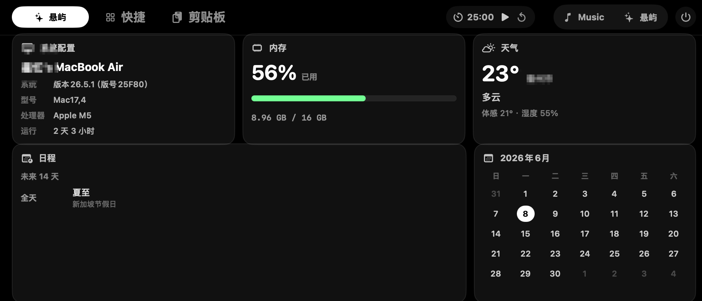
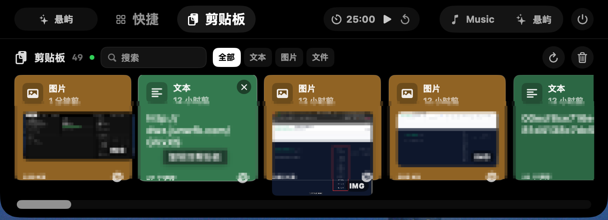
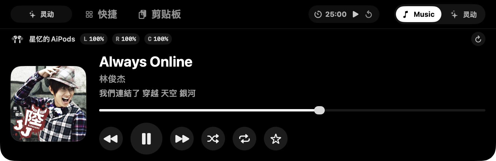
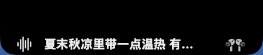
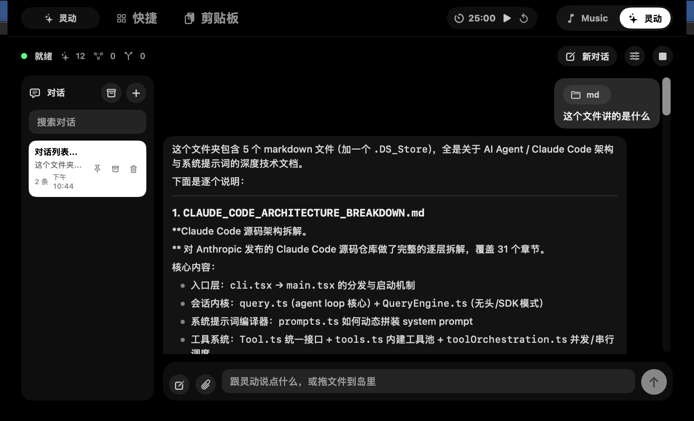

# 悬屿

<p align="center">
  <strong>把 MacBook 顶部变成一个轻量、常驻、可操作的工作入口。</strong>
</p>

<p align="center">
  <a href="https://github.com/ali156666/notchdeck/releases/latest"></a>
  <a href="./LICENSE"></a>
  
  
  
</p>

<p align="center">
  <a href="#快速开始">快速开始</a>
  ·
  <a href="#功能">功能</a>
  ·
  <a href="#开发">开发</a>
  ·
  <a href="#交流与赞赏">交流与赞赏</a>
  ·
  <a href="#贡献">贡献</a>
</p>

<p align="center">
  
</p>

悬屿是一个 macOS 顶栏悬浮面板应用。它贴着 MacBook 顶部运行，把音乐控制、AirPods 电量、剪贴板、快捷启动、系统看板、番茄钟和本地 Agent 收在一个干净入口里。

<p align="center">
  官网地址：<a href="https://notchdeck.xyz/">https://notchdeck.xyz/</a>
  <br>
  API 推荐：<a href="https://shop.xuedingtoken.com/?dist=KDLDYHBS">https://shop.xuedingtoken.com/?dist=KDLDYHBS</a>
</p>

## 功能

### 顶栏面板

- 贴合 MacBook 刘海区域的展开/收起面板
- Dashboard、音乐、快捷应用、剪贴板、Agent 多模式切换
- 收起状态下保留轻量提醒，不打断当前窗口

### 媒体与设备

- Apple Music 与 Spotify 播放状态读取
- 播放、暂停、上一首、下一首控制
- 当前歌词展示
- 收起状态歌词悬浮展示
- AirPods 左耳、右耳与充电盒电量读取

### 工作流

- 快捷启动常用应用
- 剪贴板历史面板
- 系统看板、天气、日历与番茄钟
- 专注/休息计时、暂停、重置和完成提醒

### Agent

- 内置独立 Node Agent runtime，不依赖外部 CLI
- 支持 OpenAI-compatible 与 Anthropic-compatible 模型接口
- 应用内配置模型、API key、自定义 skills 和本地 MCP servers
- 工具调用确认、文件上传、桌面文件拖入识别和附件对话
- 本地对话、记忆与会话管理

## 截图

| 系统看板                                                           | 剪贴板                                                             |
| -------------------------------------------------------------- | --------------------------------------------------------------- |
|  |  |
|                                                                |                                                                 |

| 音乐控制 | 歌词悬浮 |
| --- | --- |
|  |  |

| Agent 设置 |
| --- |
|  |

## 快速开始

### 环境要求

- macOS 14 或更新版本
- Xcode Command Line Tools
- Node.js 18 或更新版本

### 从源码运行

```bash
git clone https://github.com/ali156666/notchdeck.git
cd notchdeck/Xuanyu
./build.sh
```

`build.sh` 会完成三件事：

- 构建 `AgentRuntime/dist/runtime.mjs`
- 编译 Swift 应用
- 生成并启动 `dist/悬屿.app`

### 打包 DMG

```bash
./scripts/package-dmg.sh
```

生成的安装包位于 `dist/`。

## 配置

Agent 配置保存在本机应用支持目录：

```text
~/Library/Application Support/Xuanyu/agent/config.json
```

API key 由应用内 Agent 设置面板写入本机配置文件。这个文件不属于仓库内容。

## 权限

悬屿会按功能请求 macOS 权限：

| 权限 | 用途 |
| --- | --- |
| Apple Events | 读取和控制 Apple Music、Spotify |
| Bluetooth | 读取 AirPods 连接状态与电量 |
| Calendar | 在系统看板显示近期日程 |
| Location | 获取当前位置，用于天气信息 |
| Network | 请求歌词、天气和模型接口 |

## 项目结构

```text
Xuanyu/
├── AgentRuntime/        # Node Agent runtime
├── Sources/Xuanyu/      # macOS Swift 应用源码
├── Tests/XuanyuTests/   # Swift 测试
├── docs/                # 设计和实现文档
├── scripts/             # 打包脚本
├── Info.plist           # App bundle 配置
├── Package.swift        # SwiftPM manifest
└── build.sh             # 本地构建与运行脚本
```

## 开发

### Swift 应用

```bash
swift build
```

### Agent runtime

```bash
cd AgentRuntime
npm test
```

### 测试

```bash
swift test
```

如果 `swift test` 报 `no such module 'XCTest'`，请确认当前 `xcode-select` 指向完整 Xcode 或包含 XCTest 的 Command Line Tools。

## 常见问题

### 应用启动后没有出现在 Dock

悬屿是顶栏常驻应用，`Info.plist` 中启用了 `LSUIElement`，不会作为普通 Dock 应用显示。

### 音乐控制不可用

确认系统已经授权悬屿控制 Apple Music 或 Spotify。也可以在系统设置里重新打开自动化权限。

### AirPods 电量为空

确认 AirPods 已连接当前 Mac。部分 macOS 版本返回的蓝牙字段会延迟刷新，可以重新打开面板或等待系统更新蓝牙状态。

### Agent 无响应

先检查 Agent 设置里的模型地址和 API key，再运行：

```bash
cd AgentRuntime
npm test
```

## 贡献

欢迎提交 issue 和 pull request。提交前请先跑：

```bash
swift build
(cd AgentRuntime && npm test)
```

适合优先贡献的方向：

- 更多 macOS 设备状态卡片
- 更稳定的 AirPods 状态解析
- Agent runtime 测试用例
- UI 细节、无障碍和多屏适配
- 文档、截图和安装说明

## 交流与赞赏

QQ 交流群：`782676841`

如果悬屿对你有帮助，可以请作者喝杯茶。

<p>
  
</p>

## 许可证

本项目使用 MIT License。见 [LICENSE](./LICENSE)。
